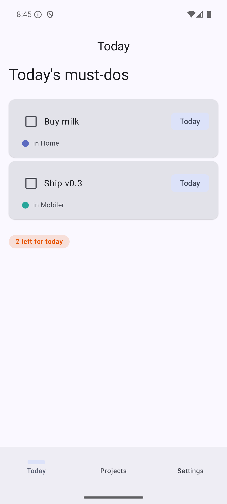

# Mobiler

[](https://github.com/mobiler/mobiler/actions/workflows/ci.yml)
[](https://crates.io/crates/mobiler)

> **React Native, but Rust + Compose.** Write your mobile app's logic *and* its UI in Rust, and render to real native widgets.

**Status: early & experimental (v0.1). Android only. APIs and project layout will change.**

## What it is

Mobiler builds on [Crux](https://github.com/redbadger/crux): a Rust core owns all
state, events, and business logic, with no business logic in the native layer. On top
of that headless-core pattern, a Mobiler core's view function also returns a **`Widget`
tree**, and a thin, app-agnostic **Jetpack Compose** shell renders that tree into real
native Material 3 widgets. Taps and input flow back into the Rust core across the FFI
(uniffi + bincode). You write the app once, in Rust; the native shell stays generic.

The `mobiler` CLI scaffolds a project and drives the whole loop — Rust core → Kotlin
type generation → Gradle APK → install and launch on a device — plus a file watcher.
The widget vocabulary and runtime live in the `mobiler-ui` / `mobiler-core` crates,
so the native shell is **generic**: built once from a fixed ABI and reused for every
app, never regenerated per app.

## Repository layout

| Path | What |
|------|------|
| `mobiler/` | The `mobiler` CLI (crate + embedded `templates/` scaffold) |
| `mobiler-ui/` | The fixed UI wire ABI — app-agnostic `Widget` tree + `Action` protocol |
| `mobiler-core/` | The runtime — the `MobilerApp` trait, Crux shell adapter, typed widget builders, capabilities |
| `demos/todo/` | Todo / projects showcase — see [demo README](demos/todo/) |
| `demos/coffee/` | Coffee-shop storefront (images, grid, chips) — see [demo README](demos/coffee/) |

> **Monorepo** for now. Each demo under `demos/` is a self-contained project (its own
> workspace, not a member of the CLI's), just like `mobiler new` produces — so any of
> them can later be extracted into its own repository.

## Demos

| [Todo](demos/todo/) | [Coffee](demos/coffee/) |
|:---:|:---:|
|  |  |
| Lists, cards, checkboxes, per-project colors, dark mode | Network images, hero overlay, category-filtered product grid, terracotta brand |

## Quick start

You'll need the Rust toolchain (with Android targets), the Android SDK/NDK, and an
emulator or device. `mobiler doctor` checks your host for the pieces it needs.

```bash
# build the CLI
cargo build -p mobiler

# check the host has everything needed
cargo run -p mobiler -- doctor

# scaffold a new app
cargo run -p mobiler -- new myapp

# build, install, and launch on a connected device/emulator
cd myapp
cargo run -p mobiler -- dev      # or `watch` to rebuild on every change
```

Once `mobiler` is on your `PATH`, the commands are simply `mobiler new`,
`mobiler dev`, `mobiler watch`, and `mobiler doctor`.

## License

Dual-licensed under either of

- MIT license ([LICENSE-MIT](LICENSE-MIT))
- Apache License, Version 2.0 ([LICENSE-APACHE](LICENSE-APACHE))

at your option.
