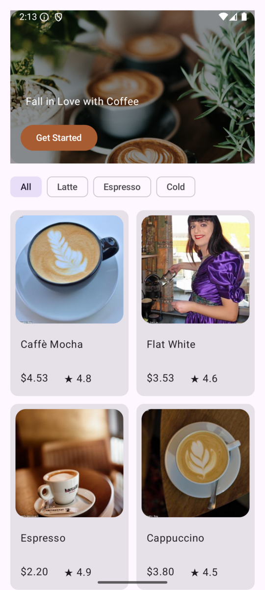
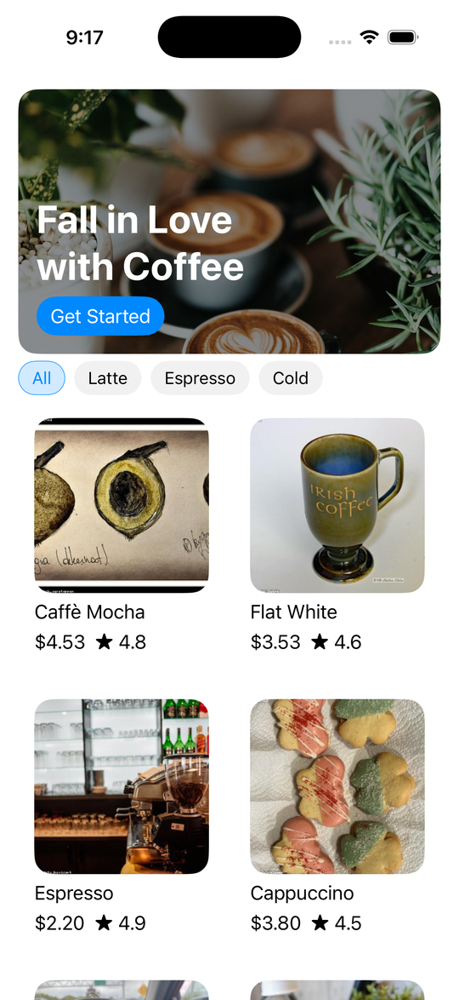
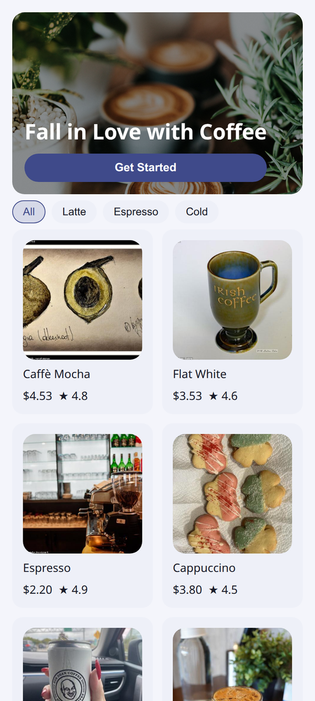
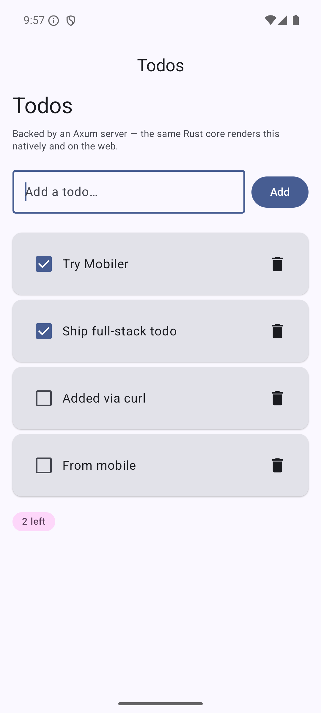
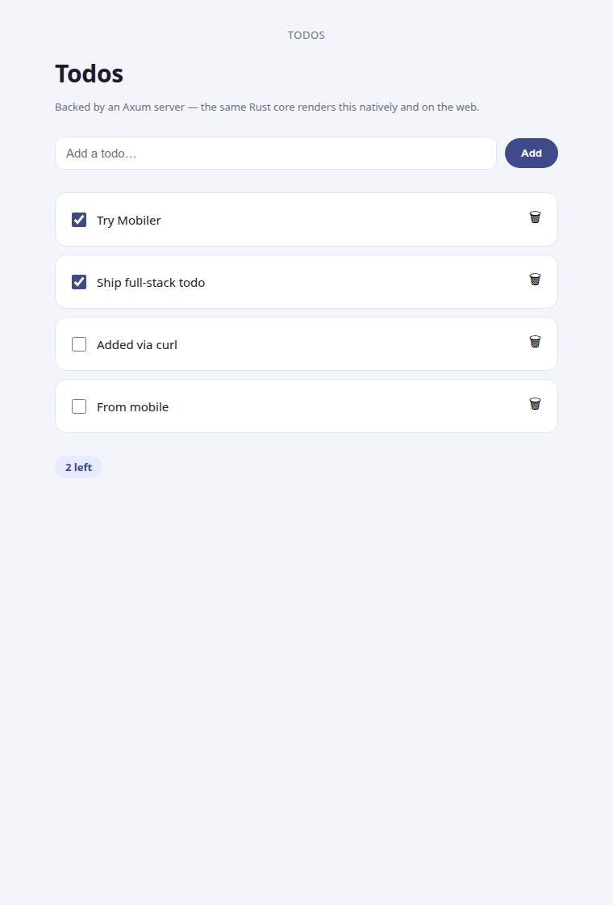
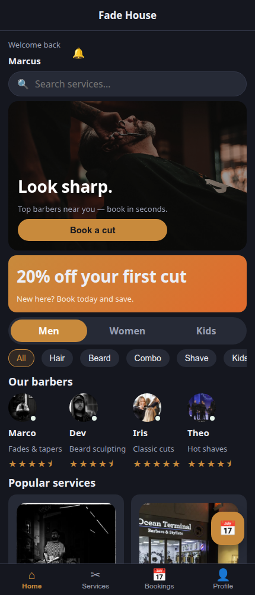
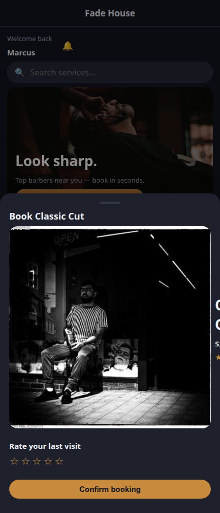
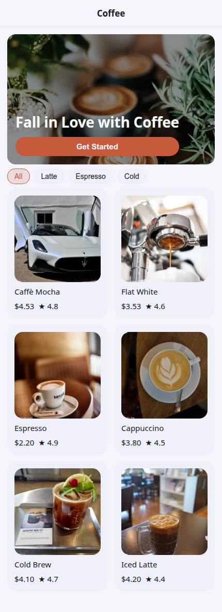
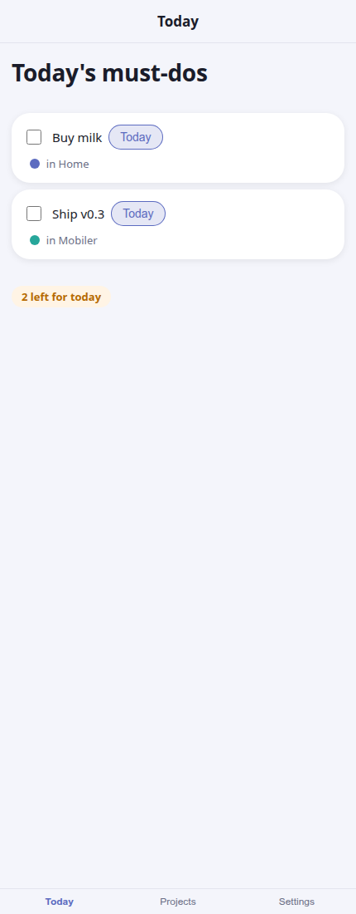

# Mobiler

[](https://github.com/mobiler/mobiler/actions/workflows/ci.yml)
[](https://crates.io/crates/mobiler)

> **Build mobile apps in Rust — the logic *and* the UI — rendered to real native widgets.**

**Status: experimental.** Android (native Jetpack Compose) and **iOS**
(SwiftUI) shells both render the same app core, which also runs on the **web**
(Leptos/WASM — see the full-stack demo). iOS is verified on the simulator. APIs may
still change.

**Capabilities & plugins at a glance** — device/platform features your Rust core calls, all rendered natively:

> **Built in:** HTTP · storage · clipboard · share · browser · toast · device · haptics · confirm · photo · camera
>
> **Plugins** (`mobiler plugin add`): 🔎 scanner (barcode/QR) · 🔐 biometric (Face ID/fingerprint) · 🗝️ securestore · 🔌 websocket · 🔔 notifications · 🔋 battery

→ [Built-in capabilities](#built-in-capabilities) · [Plugins](#plugins--mobiler-plugin-add)

## What it is

Mobiler builds on [Crux](https://github.com/redbadger/crux): a Rust core owns all
state, events, and business logic — none of it in the native layer. On top of that,
a Mobiler core's `view` returns a fixed **`Widget` tree**, and a thin, **app-agnostic
shell** renders that tree to real platform widgets. Events flow back into the core as
typed messages.

The shell is **generic**: it's built once from a fixed wire ABI and renders *any*
Mobiler app — no per-app native code, no per-app UI codegen. That's the whole idea:

- **Android** → Jetpack Compose → Material 3 (shipped)
- **iOS** → SwiftUI (simulator-verified)
- **Web** → DOM via Leptos/WASM (the `mobiler-web` shell — demonstrated in `demos/fullstack-todo`)

…all driven by the same Rust core.

## What a Mobiler app looks like

```rust
use mobiler_core::*;
use serde::{Deserialize, Serialize};

#[derive(Default)]
struct Counter;

#[derive(Serialize, Deserialize, Clone)]
enum Msg { Increment, Greet }

#[derive(Default)]
struct Model { count: i32 }

impl MobilerApp for Counter {
    type Event = Msg;
    type Model = Model;

    fn update(&self, msg: Msg, model: &mut Model, cx: &mut Cx<Msg>) {
        match msg {
            Msg::Increment => model.count += 1,
            // Device APIs are capabilities — here the built-in toast.
            Msg::Greet => cx.toast("Hello from Rust!"),
        }
    }

    fn view(&self, model: &Model) -> Widget {
        column(vec![
            title("Counter"),
            text(format!("count: {}", model.count)),
            row(vec![
                button("Increment", ButtonStyle::Filled, Msg::Increment),
                button("Toast", ButtonStyle::Outlined, Msg::Greet),
            ]),
        ])
    }
}

/// The shell renders this — `Event`/`ViewModel` are the fixed Mobiler ABI, so the
/// native shell stays generic and is built once for every app.
pub type App = MobilerShell<Counter>;
```

You write typed `Msg` events, a `Model`, and a `view` built from widget builders.
Mobiler serializes events into opaque tokens behind the scenes; the shell never sees
your app's types.

## Key ideas

- **Generic shell** — one prebuilt shell renders any app; adding a platform = writing
  one shell, not one-per-app.
- **Capabilities = plugins** — device APIs (clipboard, share, HTTP, …) are async
  effects fulfilled by the shell's plugin registry; adding one never changes the wire
  ABI, and an unknown plugin degrades gracefully. See
  [Built-in capabilities](#built-in-capabilities).
- **Navigation** — a core-owned `Nav` stack drives animated push/pop and the system
  back button.
- **Theme-as-data** — e.g. dark mode is a value in the `Widget` tree; the shell themes
  the whole app from it.

## Built-in capabilities

Device APIs are **capabilities** — async effects the generic shell fulfils natively on
all three platforms (Android, iOS, web), reached through typed `cx` helpers in your
`update`. These ship in the shell out of the box:

<!-- capabilities:start format=table (generated from capabilities.json — run `cargo run -p xtask -- gen-readme`) -->
| Capability | Rust API | Notes |
|---|---|---|
| HTTP | `cx.get / cx.post / cx.patch / cx.delete` | request/response (JSON) |
| Storage | `cx.save (+ restore on launch)` | persist the model |
| Clipboard | `cx.copy(text)` | copy text |
| Share | `cx.share(text)` | system share sheet |
| Browser | `cx.open_url(url)` | open a link externally |
| Toast | `cx.toast(text)` | transient message / snackbar |
| Device | `cx.device_model(then)` | device/model string |
| Haptics | `cx.haptic(style)` | light / medium / heavy |
| Confirm | `cx.confirm(title, message, then)` | native yes/no dialog |
| Photo | `cx.pick_photo(then)` | system photo picker → local image URI (no permission) |
| Camera | `cx.capture_photo(then)` | system camera → local image URI |
| Date picker | `cx.pick_date(then)` | native date picker → ISO YYYY-MM-DD string |
| Time picker | `cx.pick_time(then)` | native time picker → 24-hour HH:MM string |
<!-- capabilities:end -->

Each maps to an opaque `{plugin, op, input}` effect, so **adding a capability is a
shell-registry entry — it never changes the wire ABI** or the generated bindings.

## Plugins — `mobiler plugin add`

Advanced/native capabilities ship as **droppable plugins**: one command installs the native handler
into your app and patches the per-shell registration — no framework code, no ABI change. Bundled
free plugins:

| Plugin | Capability | `mobiler plugin add …` |
|---|---|---|
| 🔎 **scanner** | barcode / QR scanning | `mobiler plugin add scanner` |
| 🔐 **biometric** | Face ID / fingerprint auth | `mobiler plugin add biometric` |
| 🗝️ **securestore** | encrypted key/value (Keychain / Keystore) | `mobiler plugin add securestore` |
| 🔌 **websocket** | persistent real-time connection | `mobiler plugin add websocket` |
| 🔔 **notifications** | local scheduled notifications (reminders) | `mobiler plugin add notifications` |
| 🔋 **battery** | device battery level (sample) | `mobiler plugin add battery` |

```bash
mobiler plugin list            # see the bundled (free) plugins
mobiler plugin add scanner     # install one into the current app
```

Call a plugin from Rust via the generic escape hatch — `cx.plugin("scanner", "scan", "", then)` →
`PluginResponse { ok, output }`. A plugin is a self-describing package (`mobiler-plugin.toml` +
native sources); `mobiler plugin add` also accepts a **local package directory**, which is how
commercial/licensed plugins (e.g. NFC) are delivered.

## Repository layout

| Path | What |
|------|------|
| `mobiler/` | The `mobiler` CLI (crate + embedded `templates/` scaffold) |
| `mobiler-ui/` | The fixed UI wire ABI — app-agnostic `Widget` tree + `Action` protocol |
| `mobiler-core/` | The runtime — `MobilerApp` trait, Crux shell adapter, typed widget builders, capabilities |
| `demos/todo/` | Todo / projects showcase (lists, cards, nav, per-project colors, dark mode) |
| `demos/coffee/` | Coffee-shop storefront (network images, hero overlay, product grid) |
| `demos/fullstack-todo/` | One Axum server + shared `domain`, rendered native **and** on web |

> **Monorepo** for now. Each demo under `demos/` is a self-contained project (its own
> workspace, like `mobiler new` produces) — so any can be extracted to its own repo.

## Demos

**Same core, every platform.** The `coffee` storefront — one Rust core, the *same*
`Widget` tree — rendered by the stock Android, iOS, and web shells, no per-platform
UI code:

| Android (Jetpack Compose) | iOS (SwiftUI) | Web (Widget→DOM) |
|:---:|:---:|:---:|
|  |  |  |

And the full-stack demo shows that same core rendered natively **and** as a web app,
both backed by one Axum server:

| Android (Compose) | Web (Widget→DOM) |
|:---:|:---:|
|  |  |

See [`demos/fullstack-todo`](demos/fullstack-todo/), [`demos/todo`](demos/todo/), and
[`demos/coffee`](demos/coffee/).

## Theming & UI vocabulary

One core, one `Widget` tree — `with_theme(...)` gives each app its own brand (seed
color, corner radius, font, density), and the widget set covers real product UI: icon
tab bars, a floating action button, cards, star ratings, avatars, horizontal carousels,
segmented controls, search fields, and bottom sheets — plus native capabilities like
`cx.pick_date` / `cx.pick_time`.

**Fade House** ([`demos/barbershop`](demos/barbershop/)) — a barbershop booking demo: a
brass-on-dark brand, an icon tab bar + FAB, a brand-gradient promo banner, an avatar
rail with ratings, and a tap-to-book bottom sheet with a date → time → confirm flow.

| Home | Booking sheet |
|:---:|:---:|
|  |  |

The *same* stock shells, re-themed — coffee with a terracotta brand, todo with indigo —
no shell code changed, just a `Theme` value:

| coffee (terracotta) | todo (indigo) |
|:---:|:---:|
|  |  |

## Quick start

You'll need the Rust toolchain (with Android targets), the Android SDK/NDK, and an
emulator or device.

```bash
cargo install mobiler        # or, from this repo: cargo build -p mobiler
mobiler doctor               # check your host has everything
mobiler new myapp            # scaffold an app (Rust core + generic native shells)
cd myapp
mobiler dev                  # build core → generate types → build APK → install + launch
#   mobiler watch            # …and rebuild on every change
```

Edit `shared/src/app.rs` (your `MobilerApp`) and re-run `mobiler dev`.

**Building with a coding agent?** Add `--agentic` to `mobiler new` to drop a `CLAUDE.md` guide
into the scaffold so e.g. Claude Code writes idiomatic Mobiler. Bare `--agentic` assumes a
mobile app talking to any API or storing data on-device; tailor it with `--agentic shared-ui`
(same UI on mobile + web) or `--agentic api` (reusable core + JSON API backend).

On a Mac, the scaffold also includes an iOS shell — `bash iOS/build-ios.sh` builds
it for the simulator (needs Xcode + [XcodeGen](https://github.com/yonaskolb/XcodeGen);
no Apple account or signing required).

## Upgrading an app — `mobiler upgrade`

The generic native shells (the `Widget`-tree interpreter on each platform) are scaffolded
into your project, so a new framework version's shell improvements don't arrive by bumping a
dependency. `mobiler upgrade` pulls them in, from the app root:

```bash
cargo install mobiler   # get the newer CLI first
cd myapp
mobiler upgrade         # 3-way merge; review results as *.mobiler-new
mobiler upgrade --apply # …or write the merged shells in place (a *.mobiler-bak is saved)
```

**True 3-way merge.** `mobiler new` snapshots the pristine shells into `.mobiler/base/` (the merge
*ancestor*), so `upgrade` can reconcile three versions per file — the ancestor, your current file,
and the new template — exactly like `git merge`. Framework improvements apply **and** your edits and
plugin injections are preserved; only genuinely overlapping changes become a conflict, written as
`<file>.mobiler-new` with `<<<<<<<`/`>>>>>>>` markers (never auto-applied). It **never** touches your
Rust app code (`shared/src/`). It also bumps your `mobiler-core` dependency. By default a clean merge
is offered as `<file>.mobiler-new`; `--apply` writes it in place after saving a `.mobiler-bak`. Commit
`.mobiler/` so the baseline (and version stamp) travel with the repo. Apps scaffolded before baselines
existed fall back to a conservative reconcile and get a baseline written for next time.

## License

Dual-licensed under either of [MIT](LICENSE-MIT) or [Apache-2.0](LICENSE-APACHE), at
your option.
