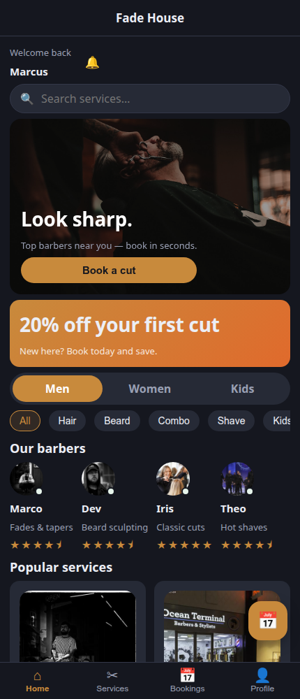
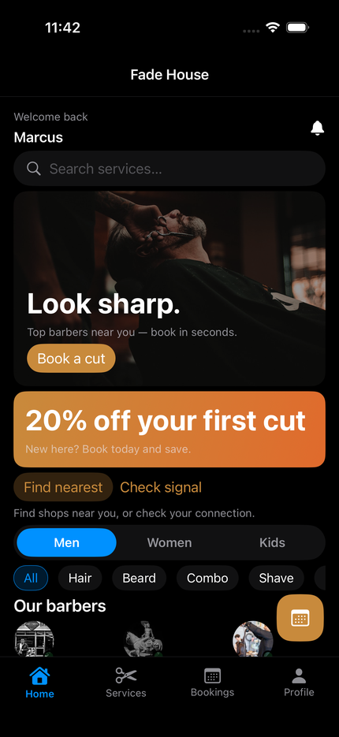
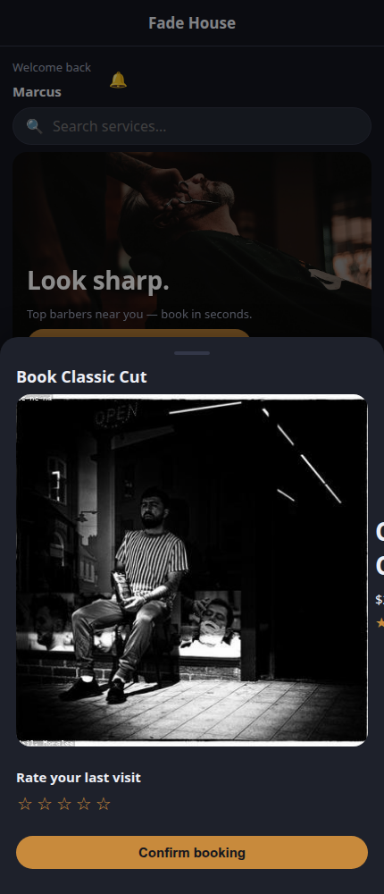
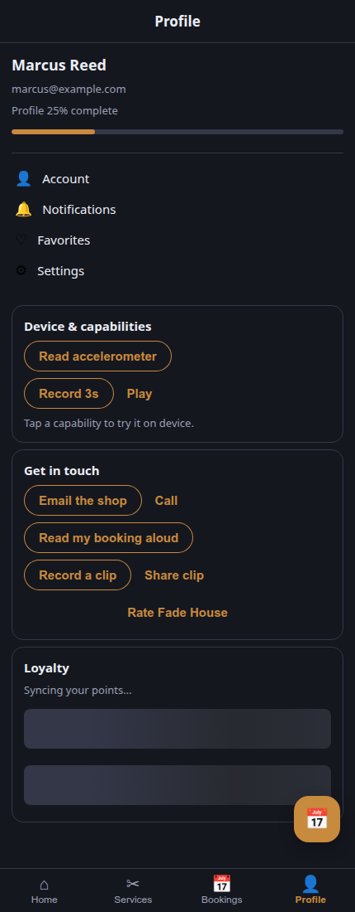

# Barbershop demo — "Fade House"

A grooming/booking app built on **Mobiler**, used as the showcase for the broader UI
vocabulary. One Rust core (`app-core/` + the native `shared/` crate) renders on the web (via
`mobiler-web`) **and natively on iOS + Android** through the generic shells — the same `Widget`
tree, no per-platform UI code.

| Home — web | Home — iOS (native) | Booking sheet — web | Profile — capabilities & widgets |
|:---:|:---:|:---:|:---:|
|  |  |  |  |

What it exercises:

- **Icon bottom-tab bar** — Home / Services / Bookings / Profile, each with an icon (`tab_icon`).
- **Floating action button** — a "book now" FAB over the body (`with_fab`).
- **Expanded icon set** — scissors, calendar, bell, person, heart, … (the grown `Icon` enum).
- **Theming** — a warm brass brand on a dark shell (`with_theme` + `dark_mode`), the classic
  barbershop look.
- Plus the existing vocabulary: themed `Scaffold`, hero `Box` (scrim image + CTA), category
  `Chip`s, a service `Grid` of tappable `Card`s with images, prices, ratings, and badges.

Later vocabulary phases extend it: a search bar + category carousel, segmented filters, star
ratings, avatars, a booking bottom sheet, and a native date/time picker.

The **Profile** tab showcases the newer widgets + free bundled plugins (native only): a
determinate **`Progress`** bar ("profile completeness"), **`Skeleton`** shimmer placeholders, and
"Get in touch" capability demos — email/call (`composer`), speak a booking (`tts`), record →
share a clip (`video` → `sharefile`), and an App Store review prompt (`review`), alongside the
earlier `sensors`/`audio`/`contacts`/`calendar`/`geolocation`/`connectivity` demos.

## Run (web)

```bash
cd web
trunk serve         # or: trunk build  → dist/
```

(If `trunk build` errors on the toolchain, prefix with `RUSTUP_TOOLCHAIN=stable` — the demos pin
Android-only targets for native builds.)
