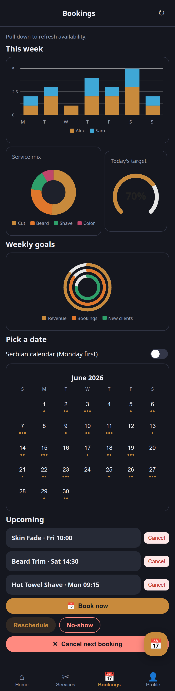
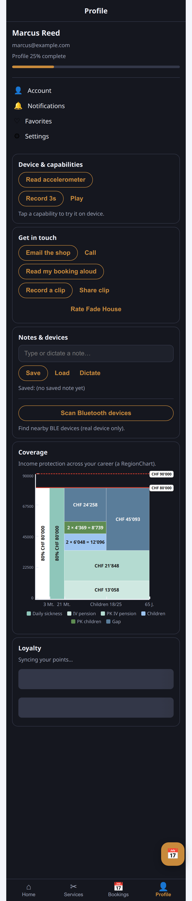
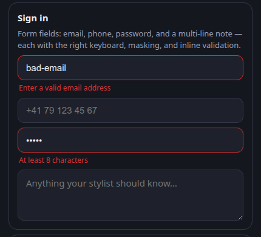

# Barbershop demo — "Fade House"

A grooming/booking app built on **Mobiler**, used as the showcase for the broader UI
vocabulary. One Rust core (`app-core/` + the native `shared/` crate) renders on the web (via
`mobiler-web`) **and natively on iOS + Android** through the generic shells — the same `Widget`
tree, no per-platform UI code.

| Home — web | Home — iOS (native) | Booking sheet — web | Profile — capabilities & widgets |
|:---:|:---:|:---:|:---:|
|  |  |  |  |

| Bookings — multi-series Charts (stacked bar · donut · gauge · rings) · Calendar · SwipeAction · pull-to-refresh |
|:---:|
|  |

| Profile → Coverage — a `RegionChart` (variable-width stacked-region / coverage-gap chart) |
|:---:|
|  |

| Profile → Sign in — rich form fields (keyboard kinds, secure masking, multiline) with inline validation |
|:---:|
|  |

What it exercises:

- **Icon bottom-tab bar** — Home / Services / Bookings / Profile, each with an icon (`tab_icon`).
- **Floating action button** — a "book now" FAB over the body (`with_fab`).
- **Expanded icon set** — scissors, calendar, bell, person, heart, … (the grown `Icon` enum).
- **Theming** — a warm brass brand on a dark shell (`with_theme` + `dark_mode`), the classic
  barbershop look.
- Plus the existing vocabulary: themed `Scaffold`, hero `Box` (scrim image + CTA), category
  `Chip`s, a service `Grid` of tappable `Card`s with images, prices, ratings, and badges.

Later vocabulary phases extend it: a search bar + category carousel, segmented filters, star
ratings, avatars, a booking bottom sheet, and a native date/time picker.

The **Bookings** tab showcases the heavier widgets: multi-series **`Chart`**s — a stacked bar with
y-axis + legend ("this week", split by barber), a service-mix **donut**, a today's-target **gauge**,
and weekly-goal **rings** — plus an inline month **`Calendar`** (tap a day), **`SwipeAction`** rows
(swipe a booking to reveal *Cancel*), and **pull-to-refresh** (`Scaffold.on_refresh`/`refreshing`).

The **Profile** tab showcases the newer widgets + free bundled plugins (native only): a
determinate **`Progress`** bar ("profile completeness"), **`Skeleton`** shimmer placeholders,
"Get in touch" capability demos — email/call (`composer`), speak a booking (`tts`), record →
share a clip (`video` → `sharefile`), an App Store review prompt (`review`) — and "Notes & devices":
a note saved/loaded via on-device **`sqlite`**, dictated via **`speech`**, plus a **`bluetooth`**
BLE scan, alongside the earlier `sensors`/`audio`/`contacts`/`calendar`/`geolocation`/`connectivity` demos.
It also hosts a **`RegionChart`** ("Coverage") — a variable-width stacked-region / coverage-gap chart
(arbitrary value bands across an irregular timeline, solid/dashed reference lines with chips, axis
tick marks, and a legend) — the Swiss-insurance-style visualization the widget was built for.

…and a **"Sign in" form** showing the rich text-field kinds — `email_field` / `phone_field` /
`secure_field` (masked) / `multiline_field`, each picking the right keyboard, plus inline validation
via `with_error(..)` (a bad email and a too-short password show errors live).

## Run (web)

```bash
cd web
trunk serve         # or: trunk build  → dist/
```

(If `trunk build` errors on the toolchain, prefix with `RUSTUP_TOOLCHAIN=stable` — the demos pin
Android-only targets for native builds.)
