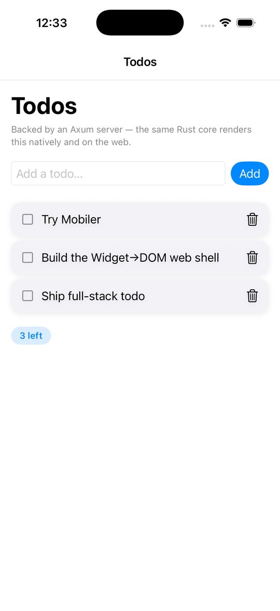
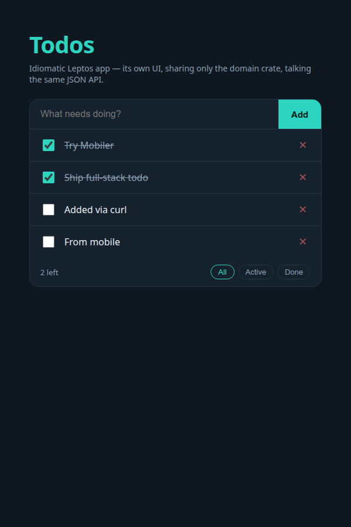

# Full-stack todo — Mobiler demo

One all-Rust product across surfaces, showing **how much you can reuse** between
mobile and web. A flat todo list backed by one Axum server (in-memory, no DB),
with the data model + API contract shared by every client via the `domain` crate.

Three clients (the native one runs on **both Android and iOS**), **one Axum
server**, all showing the same data:

<p>
  
  &nbsp;
  
  &nbsp;
  
  &nbsp;
  
</p>

It demonstrates **two reuse strategies side by side** (left→right above: native,
web-widgets, web-json):

| Client | Reuses | Point |
|---|---|---|
| `mobile/` | the whole `todo-core` (logic + `view`→`Widget`) | native Mobiler app |
| `web-widgets/` | the **same** `todo-core`, compiled to WASM | web is just *another shell* rendering the same `Widget` tree to DOM — the Mobiler superpower (essentially `mobiler-web`) |
| `web-json/` | only `domain` (types/intents) | an idiomatic Leptos app with its **own** UI (filters, its own styling), talking the same JSON |

`mobile` + `web-widgets` look the same because they're the same `view`; `web-json`
looks different by design — same data layer, divergent UI.

The API is **plain JSON REST** (not Leptos server functions) so the Mobiler core and
the web app are equal clients of the same endpoints.

## Layout

```
domain/       shared types + intents + pure logic (WASM-clean)        ✅
server/       Axum + in-memory store, JSON REST                       ✅
todo-core/    the MobilerApp (server-backed via the HTTP capability)  ✅
mobile/       native shell over todo-core/                            ✅
web-widgets/  Widget→DOM shell hosting todo-core as WASM (Leptos)     ✅
web-json/     own Leptos components, fetch JSON (shares domain only)  ✅
```

## Run

```bash
# 1) the backend (both clients point at it)
cargo run -p server                 # http://0.0.0.0:3000

# 2a) the native app — from mobile/
cd mobile && mobiler dev            # builds + launches on a device/emulator
#     (mobile reaches the host server at http://10.0.2.2:3000)

# 2b) the web apps — from web-widgets/ or web-json/
cd web-widgets && trunk serve       # http://localhost:8080  (same core, Widget→DOM)
cd web-json    && trunk serve       # idiomatic Leptos app, shares only domain
#     (both reach the server at http://localhost:3000)
```

Add/toggle/delete on either client; the change round-trips through the server and
shows up on the other after its next load. The "N left" badge is computed by
`domain::active_count` — shared pure logic, identical on every surface.
