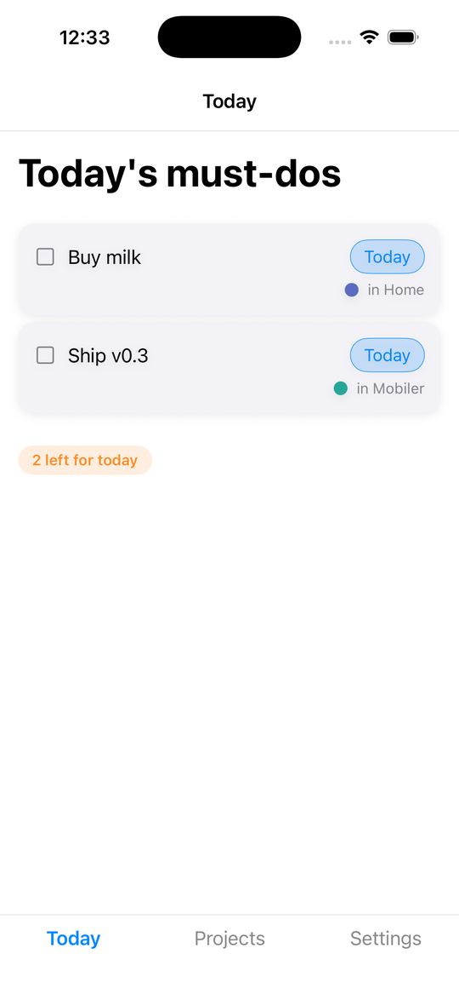
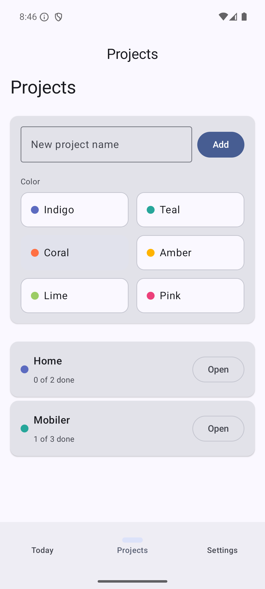

# Todo — Mobiler demo

A todo / projects app built with [Mobiler](../../). Written as a `MobilerApp` —
typed `Msg`/`Model`/`view` in Rust — with **zero per-app native code**: the same
prebuilt generic shells render its `Widget` tree natively on **Android** (Jetpack
Compose / Material 3) and **iOS** (SwiftUI), dark mode included (it also builds for
the web via `mobiler-web`). The Rust core owns all state and logic.

<p>
  
  &nbsp;
  
  &nbsp;
  
</p>

## What it shows

- **Text** styles, **Card** styles, **Checkbox** / **Switch** / **Chip** / **TextField**, **Badge** (semantic tones), **IconButton**s, **Grid**
- A bottom-nav **Scaffold** (Today / Projects / Settings) with a pushed project-detail screen (top-bar back arrow)
- Per-project identity colors via **ColorDot** and a grid color picker
- Theme-as-data: a dark-mode switch flips the whole app
- **State persisted across cold restarts** via the storage capability (`cx.save` + `restore`)

## Run

```bash
cargo install mobiler        # or use the repo build: cargo build -p mobiler
cd demos/todo
mobiler dev                  # build the core, generate Kotlin types, build + launch on a device/emulator
```
